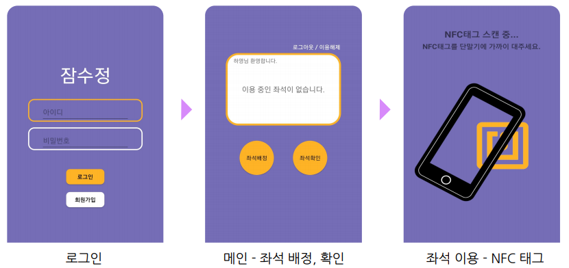
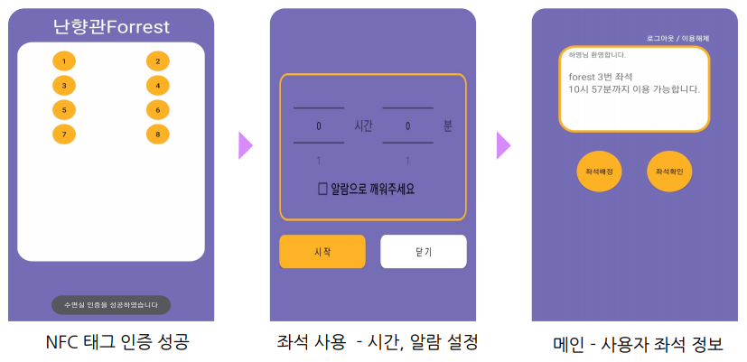
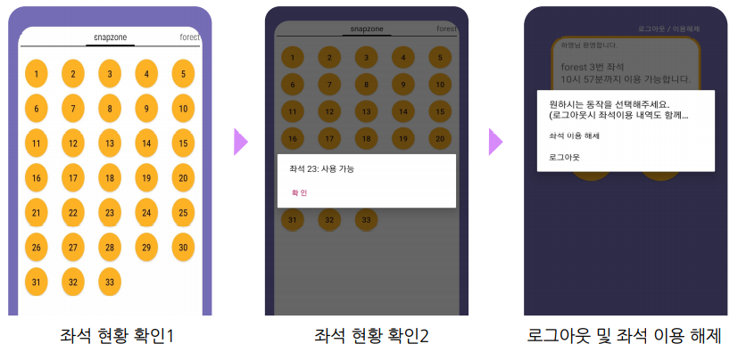

# 잠수정 - 성신여자대학교 수면실 좌석 이용 Android App   
### (2020.06.28 - 2020.11)    

### :pushpin: 사용 기술   
```
Language : Java  
Database & Back-End : Firebase (Authentication, Realtime-Database)  
Develop Environment : Android Studio, Git   
```
<br>

### :pencil: 제작 동기    
* 성신여자대학교 수면실의 경우 이용 현황을 알 수 없어서 만석의 경우, 하염없이 기다려야 하는 상황이 발생함.<br>
이러한 불편함을 해결하고자 '잠수정' 제작.<br><br>

### :pencil: 주요 기능   
* 수면실(난향관, 수정관, 운정캠퍼스)의 좌석을 원하는 시간만큼 설정  
* 각 수면실 별 이용 좌석의 남은 시간들을 한 눈에 볼 수 있도록 제공   
* 좌석 이용시, 알람 기능 제공   
* 좌석 이용은 각 수면실의 NFC를 태그해야만 사용 가능하도록 기능 제공<br><br>

### :pencil: 앱 UI 소개
* 사용자 앱 시나리오 <br><br>
 <br><br>
 <br><br>
  <br><br>

### :pencil: 보완 방향
* 이어폰 착용했을 때에는 소리 알람 / 착용하지 않았을 때에는 진동 알람으로 기능 보완 예정   
* 사용자의 이용 시간이 지나면 저절로 좌석이 해제 되도록 해제 기능 보완 예정   
* 반복되는 코드 함수화 및 코드 리팩토링   
* Firebase 대신 Back-End 서버 구축 및 클라우드 서버 deploy   
* 전체적인 버그 및 앱 테스트 진행 후 PlayStore 배포 예정   
